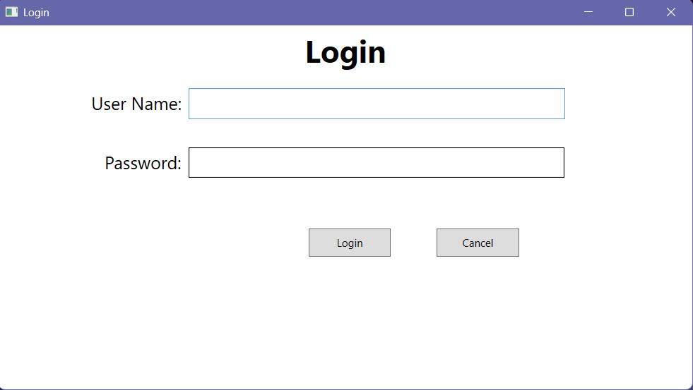
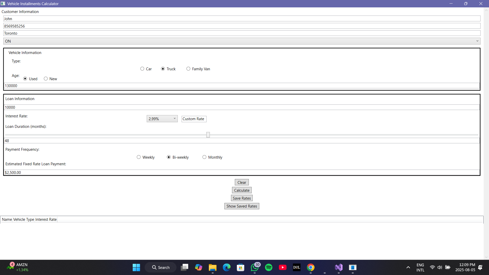
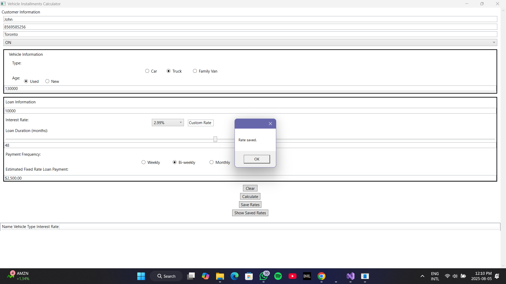

<h2>Screenshot Gallery</h2>

  
  
  

# 🚗 Vehicle Installments Calculator (WPF Desktop Application)

This is a WPF desktop application built using C# and XAML that helps users calculate vehicle loan installment payments based on customer input, vehicle details, interest rates, and payment frequency.

## 🔐 Login Credentials

Before accessing the main application, users must log in using the following credentials:

- **Username:** `sickboy`
- **Password:** `12345`

> After successful login, the user is redirected to the main application window.

---

## 🧾 Features

- **User Authentication:** Simple login page for secure access to the app.
- **Customer Information Entry:** Inputs for name, contact number, city, and province.
- **Vehicle Information:**
  - Type selection (Car, Truck, Family Van)
  - Condition (Used or New)
  - Price input
- **Loan Details:**
  - Loan amount input
  - Interest rate selection or custom rate
  - Loan duration (via slider)
  - Payment frequency (Weekly, Bi-weekly, Monthly)
- **Installment Calculation:**
  - Automatically calculates estimated fixed-rate loan payments
- **Saved Rates:**
  - Save calculated rates for future reference
  - View previously saved rates in a grid below the calculator
- **Utility Buttons:**
  - **Clear:** Resets all form fields
  - **Calculate:** Computes the loan payment
  - **Save Rates:** Stores the calculated rate
  - **Show Saved Rates:** Displays saved entries in the grid

---

## 🛠️ Technologies Used

- C# (.NET Framework)
- WPF (Windows Presentation Foundation)
- XAML for UI Design
- Object-Oriented Programming Principles

---
## 🚀Getting Started 

1. Clone the repository:
   bash
   git clone https://github.com/your-username/vehicle-installments-calculator.git
2. Open the project in Visual Studio.

3. Build the solution:

  - Ensure .NET Framework is installed.

  - No external packages required.

4. Run the application:

  - Login with the default credentials: -
    Username: sickboy
    Password: 12345

  - Use the calculator to simulate vehicle loan installments.

